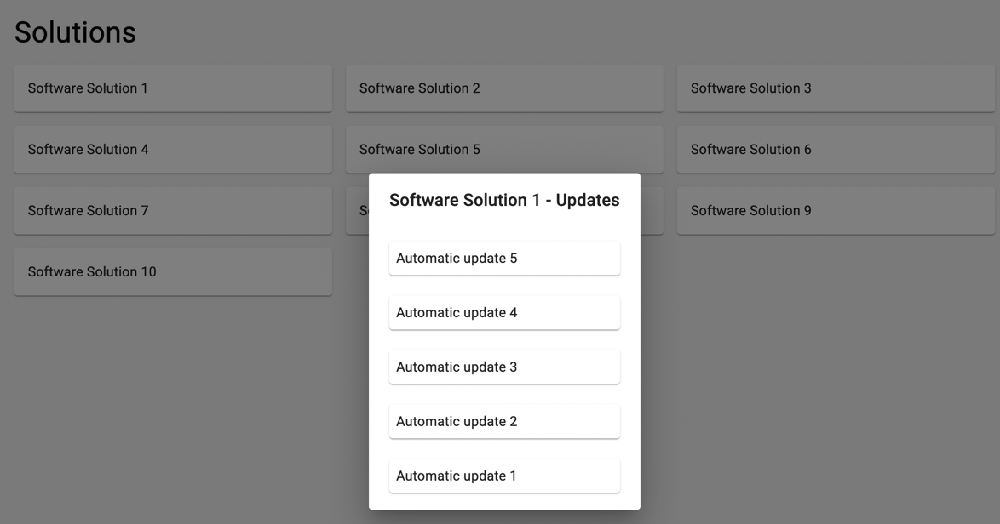
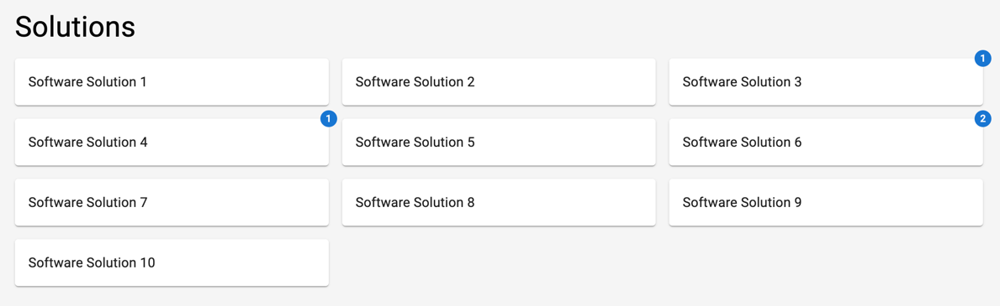
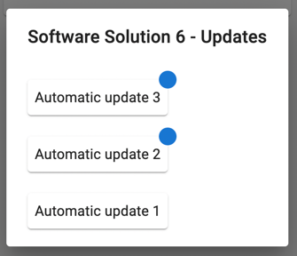

# Softwaregini Fullstack Challenge

Imagine you are tasked with extending our existing functionalities. We have a simple frontend application that fetches a
list of software solutions from a backend and displays them. The user can click on a software solution which opens a
dialog with updates.



Our users don't want to click on each software solution to see if there are updates. They would prefer to only check out
the dialog when there are new updates. Your task is to implement a badge that indicates new updates to the user.

Acceptance criteria:

* Each software solution has a badge that shows the number of updates which the user has not seen yet
  

* Each software solution update item within the dialog should have a badge if the user has not seen it yet
  

* The state that our user has seen an update should be stored in the backend

You can use the Badge component from the MUI component library which is already installed in this
project https://mui.com/material-ui/react-badge/

For the sake of simplicity, you don't need to worry about user identity. Just assume there is only one user consuming
these APIs.

Focus on completing the acceptance criteria. You can change the existing code as you see fit. Think about how your
implementation would scale if we wanted to add the same functionality for other things.

Your time is valuable, so don't spend more than 2 hours on this challenge. If you don't finish in time, please write a
short summary of what you would have done next. We will discuss your solution in the next interview. You will also have
the opportunity talk about areas where you would have improved the functionality or codebase next.

## Setup

First let's make sure everything runs on your system.

### Backend

You need to have at least Java 17 installed. Gradle is also needed.

In the backend directory, run
```gradle bootRun```

The backend should start on port 8080. You can check if it is running by opening http://localhost:8080/solutions in your
browser.

The backend is a simple Spring Boot application written in Kotlin. It uses an In-memory database that is automatically
reset on each startup. The schema is created automatically based on the classes annotated with @Entity. Mock data is
created on startup. Furthermore, there is a scheduler that creates a new update for a random software solution every 10
seconds.

There are two exposed endpoints:
`http:localhost:8080/solutions` for software solutions
`http:localhost:8080/solutions/{softwareSolutionId}` for software solution updates

### Frontend

You need to have Node and npm installed.

In the frontend directory, run
```npm install```
```npm start```

The frontend should start on port 3000. You can check if it is running by opening http://localhost:3000 in your browser.

## Submission

Please provide your solution as a zip file. The command below will create a zip file with the necessary files for
the `main` branch:

```git archive --format=zip --output solution.zip main```

Once you have finished the challenge, please send the zip file to david@softwaregini.com. If you have any questions,
feel to contact me anytime. Good luck! 🚀